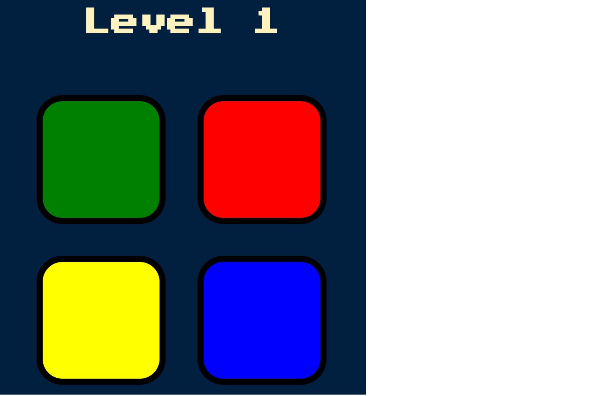

# Simon-Game
The famous Simon Game using HTML, CSS and JS. Follow The link - https://m10hit.github.io/Simon-Game/

# Idea
1. To build and develop an advanced game which is easy to play using JavaScript
2. Used event handlers, animations and audio files to develop the game.

# How to Play
1. Press any key to start
2. Check the button that is blinked (say red)
3. The player has to press that button. As soon as the player presses a button, another button get blinked (say green)
4. Now, the player needs to press on the red button and then on the green button. 
5. In the next level, if the yellow button is blinked, the player needs to press red, followed by green, followed by yellow
6. The difficulty of the game increases as the level of the game increases as the player needs to remember the sequence of the colors
7. If the player fails to remeber the sequence, the game is over.

# Screeenshot

